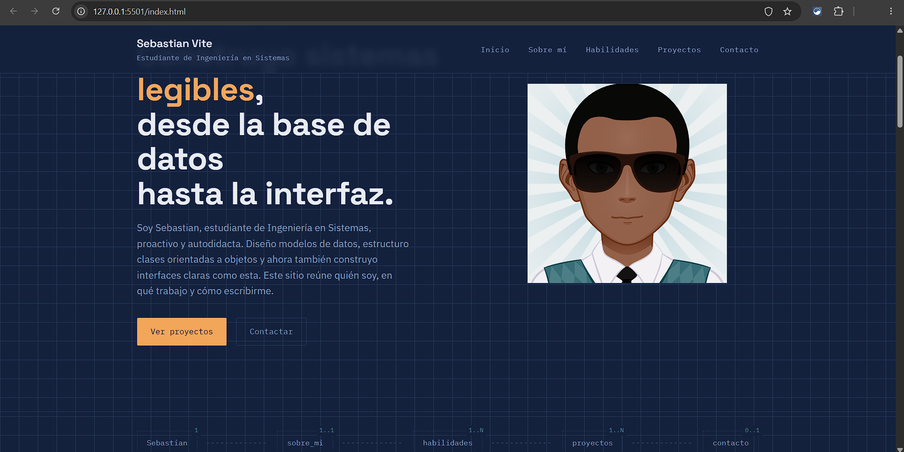

# Portafolio Personal — Sebastian Vite

**Estudiante:** Sebastian Andrés Vite Díaz
**Carrera:** Ingeniería en Sistemas

## Descripción

Portafolio personal que presenta quién soy, mis habilidades técnicas y de idioma,
dos proyectos académicos y un formulario de contacto. Hecho con HTML y CSS puro.

## Tecnologías utilizadas

- HTML5 semántico
- CSS3 (Flexbox, variables en :root, diseño responsivo)
- Git y GitHub

## Cómo visualizar el proyecto

1. Clonar este repositorio.
2. Abrir index.html en cualquier navegador.

## Captura de pantalla

